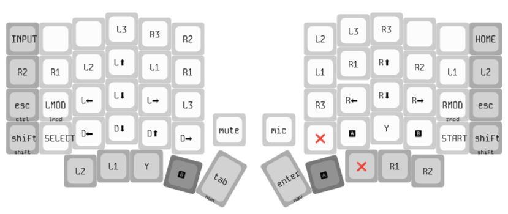

# Ermak Sofle Pico Keymap

This keymap is made by [Ross Hadden](https://github.com/rosshadden) for the [sofle_pico](https://github.com/JellyTitan/sofle_pico).

It is based on the [engram layout](https://engram.dev/), modified enough that I felt like naming it something.
The name is a combination of `colemak` and `Ermac` (a character I remember from from Mortal Kombat III).

## layout

Ermak layout:


Ermak controller layout:



## flashing

```bash
# watch and compile
./bin/keebler watch compile

# upload when keyboard enters bootloader (detects via /dev/disk)
sudo -E ./bin/keebler watch flash
```
